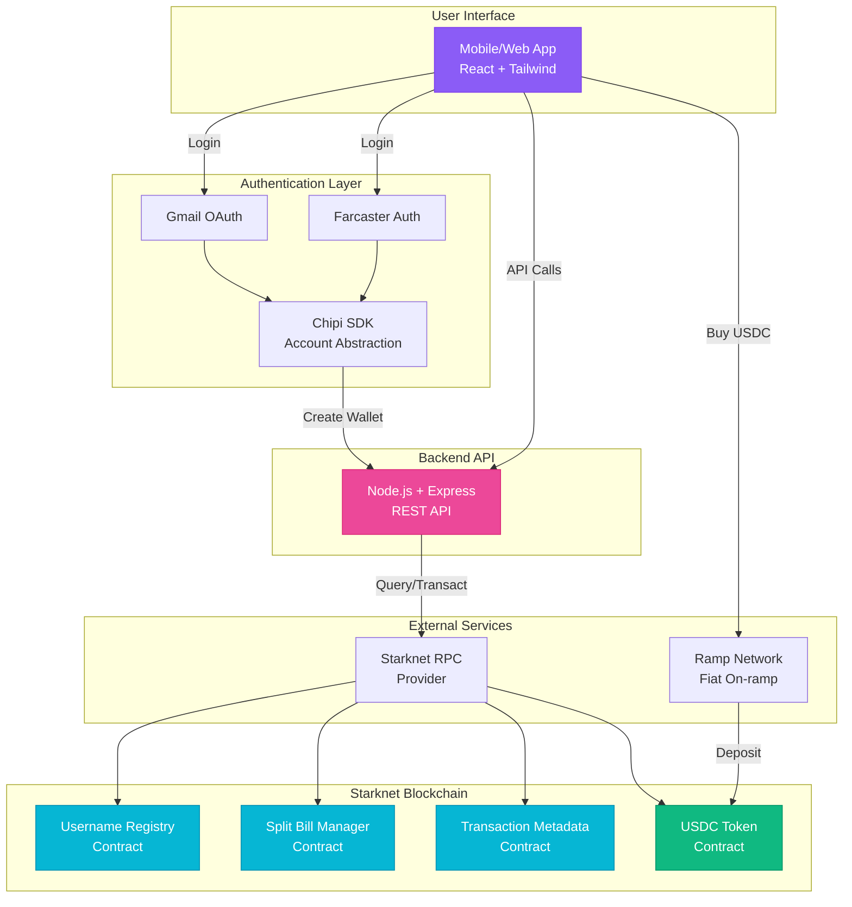
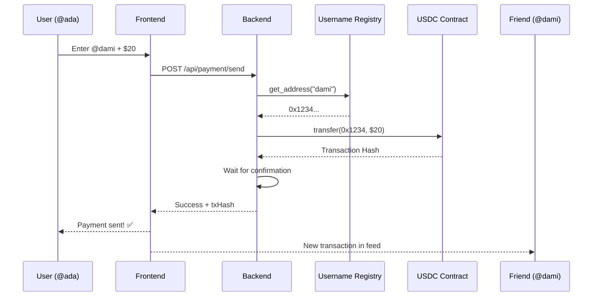
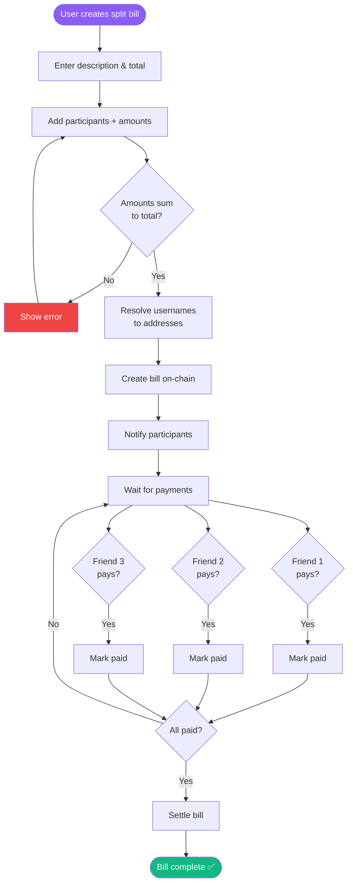

# Fliq 💸

**Flip the script on crypto payments. Just Fliq it!**

> Say hello to the Venmo of crypto—blazing-fast peer-to-peer payments on Starknet with the vibe of your favorite social app. Simple. Social. Secure.

[](https://starknet.io)
[](https://opensource.org/licenses/MIT)

---

## 🎯 Why Crypto Payments Need a Glow-Up

Crypto payments? Kinda clunky for the average Joe:

- **Tech Overload**: Seed phrases, gas fees, and those endless 42-character addresses? Yawn.
- **No Social Vibes**: Venmo showed us money *is* social. Crypto apps? They’re giving spreadsheet energy.
- **Gen Z Says Nope**: The TikTok generation wants speed and ease, but crypto UX is stuck in the dial-up era.

**The Big Miss?** Crypto’s got the goods—lightning-fast settlements, global reach, no middleman—but most folks still vibe with Venmo, Cash App, or old-school bank transfers.

---

## 💡 Enter Fliq: Your Crypto BFF

**Fliq** makes crypto payments feel as smooth as sending a DM:

✅ **Sign in with Gmail or Farcaster** — ditch the seed phrase drama  
✅ **@usernames, not addresses** — send cash to `@ada`, not `0x1234...`  
✅ **USDC zaps in <3 seconds** — powered by Starknet’s speed  
✅ **Social feed with flair** — flex your coffee run payment (or keep it private)  
✅ **Split bills like a pro** — no more “I’ll Venmo you later” excuses  

---

## 🚀 Why Fliq’s the Hottest Ticket in Town

### The Money-Making Moment

| Metric | Value | Source |
|--------|-------|--------|
| Venmo users (US) | 90M+ | Statista 2024 |
| Global P2P payments | $3.2T annually | McKinsey |
| Gen Z crypto fans | 44% own crypto | Pew Research |
| Average Venmo transaction | $50-200 | Company data |

**Our Secret Sauce**: Stablecoins like USDC give you crypto’s speed without the rollercoaster price swings. It’s the perfect bridge to everyday payments.

### Why Starknet’s the GOAT

1. **Account Abstraction Magic** — wallets created behind the scenes with Chipi SDK  
2. **Blink-and-You-Miss-It Speed** — payments settle faster than you can say “Fliq it”  
3. **Pennies for Fees** — transactions cost less than your coffee spill  
4. **Fort Knox Security** — STARK proofs keep your money locked tight  

## 🏗️ Technical Architecture

### System Architecture Flowchart



### User Flow: Send Money



### User Flow: Split Bill



### Stack Overview

```
Frontend (React + Tailwind) → Sleek and snappy UI
    ↓
Backend (Node.js + Express) → Smooth server vibes
    ↓
Starknet Blockchain (Cairo Smart Contracts) → The heart of Fliq
    ↓
USDC Token Contract → Stablecoin goodness
```

### Cairo Smart Contracts (The Cool Stuff)

1. **Username Registry** — Links `@usernames` to wallet addresses  
2. **Split Bill Wizard** — Tracks who owes what, on-chain  
3. **Transaction Metadata** — Adds social spice (messages, privacy options)  

### Power Tools

- **Starknet.js** — Talks to the blockchain like a pro  
- **Chipi SDK** — Makes wallets invisible (in a good way)  
- **Scarb** — Keeps our Cairo code in check  
- **Ramp Network** — Buy USDC with your card or bank, easy-peasy  

---

## 🎮 Try Fliq: A 2-Minute Joyride

### Newbie Journey

1. **Ada dives in** → Clicks “Login with Gmail”  
2. **Wallet appears like magic** → No seed phrase nonsense  
3. **Claims @ada** → Username locked on-chain  
4. **Grabs $50 USDC** → Via Ramp Network’s slick widget  
5. **Sends $20 to @dami** → Done in 2 seconds flat  
6. **Flexes in the feed** → “Ada paid Dami $20 for coffee ☕”  

### Split Bill Swagger

1. **Dami sets up a bill** → “Sushi Night - $120”  
2. **Tags the crew** → @ada ($30), @kofi ($30), @zara ($30), Dami ($30)  
3. **Notifications pop off** → “You owe Dami $30 for sushi”  
4. **One-tap payments** → Everyone settles up instantly  
5. **Bill done** — On-chain, stress-free  

---

## 📊 How We’ll Cash In (Post-Hackathon)

### Revenue Vibes

1. **Interchange fees** — 0.5% on cashouts ($0.25 per $50)  
2. **Premium perks** — $2.99/month for bigger transactions  
3. **Global transfers** — Tiny markup on currency swaps  
4. **Business accounts** — $19/month for merchant swagger  

### Numbers That Pop

- **Average transaction**: $75  
- **Transactions per user/month**: 8  
- **Monthly revenue per user**: $3.00  
- **Customer Acquisition Cost (CAC)**: $15 (social referrals FTW)  
- **Lifetime Value (LTV)**: $108 (3-year loyalty)  
- **LTV:CAC ratio**: 7.2x (we’re printing money!)  

---

## 🎯 Hackathon Goals (We Nailed It)

### Must-Haves (Done Deal ✅)

- ✅ Gmail/Farcaster login  
- ✅ On-chain username registry  
- ✅ Send USDC to @username  
- ✅ Social feed (public/private toggle)  
- ✅ Split bills with your squad  

### Metrics We’re Hyped About

- **Simplicity**: First payment in <2 minutes ⏱️  
- **Speed**: Transactions settle in <3 seconds ⚡  
- **Engagement**: 30%+ of demo users try split bills 📊  
- **Judge Love**: “This *is* the Venmo of crypto!” 💬  

---

## 🛠️ Get Fliq Running

### What You Need

- Node.js 18+  
- Scarb (Cairo compiler)  
- Starknet testnet account  

### Let’s Roll

```bash
# 1. Grab the code
git clone https://github.com/yourusername/fliq
cd fliq

# 2. Set up Cairo tools
curl --proto '=https' --tlsv1.2 -sSf https://docs.swmansion.com/scarb/install.sh | sh
curl https://get.starkli.sh | sh
starkliup

# 3. Deploy contracts
cd contracts
scarb build
starkli declare target/dev/fliq_UsernameRegistry.contract_class.json
starkli deploy <CLASS_HASH>

# 4. Fire up the backend
cd ../backend
npm install
cp .env.example .env  # Toss in your contract addresses
node server.js

# 5. Launch the frontend
cd ../frontend
npm install
npm start
```

**Hop in**: http://localhost:3000  

---

## 🗺️ What’s Next for Fliq

### Phase 1: MVP (Hackathon Win) ✅
- Core payments with usernames  
- Bill splitting like a boss  
- Social feed for the flex  

### Phase 2: Fiat Frenzy (Months 1-2)
- Ramp Network for USDC buys  
- Bank linking via Plaid  
- NGN off-ramp (Nigeria first)  

### Phase 3: Social Sauce (Months 3-4)
- Find friends via contacts  
- Group savings pots  
- Payment nudges & reminders  
- In-app chat for the vibes  

### Phase 4: Global Domination (Months 5-6)
- Multi-currency support (KES, GHS, USD)  
- Merchant tools (QR codes, payment links)  
- Debit card integration  
- Recurring payments  

---

## 🌍 Why Fliq’s a Big Deal

### Banking the Unbanked

- **2 billion adults** globally don’t have bank accounts  
- **Mobile-first markets** (Nigeria, Kenya, Philippines) crave better payment options  
- **Stablecoins** skip shaky banking systems  

### Fixing Crypto’s UX Fumble

Only **3% of crypto holders** use it for payments. That’s right—97% are just HODLing. Fliq’s here to make crypto *usable*.

### Speed + Simplicity = 🚀

- Venmo: 90M users by making payments fun  
- Cash App: $50B+ annual volume by cutting friction  
- **Fliq**: Crypto speed meets Venmo’s cool factor  

---

## 👥 The Dream Team

- **Your Name** — Full-stack wizard  
- **Built at**: [Hackathon Name] (October 2025)  
- **Powered by**: Starknet, Chipi SDK, Scarb  

---

## 📚 Tech Docs (For the Nerds)

### API Endpoints

#### Authentication
```
POST /api/username/register
GET  /api/username/check/:username
GET  /api/username/resolve/:username
```

#### Payments
```
POST /api/payment/send
GET  /api/balance/:address
GET  /api/transactions/:address
```

#### Split Bills
```
POST /api/bills/create
POST /api/bills/pay
GET  /api/bills/:billId
```

Full API swagger: [Postman Collection](https://documenter.getpostman.com/...)

### Smart Contract ABIs

Check `/contracts/target/dev/` after `scarb build` for the juicy ABIs.

---

## 🔒 Keeping It Safe & Private

- **Private keys stay client-side** — we don’t touch ‘em  
- **End-to-end encryption** — your data’s locked down  
- **Privacy controls** — you decide what’s public or private  
- **Audits** — Post-hackathon with Nethermind Security  

---

## 🤝 Join the Fliq Squad

We’re building in public—jump in!

1. Fork the repo  
2. Create a branch (`git checkout -b feature/epic-stuff`)  
3. Commit your magic (`git commit -m 'Added epic stuff'`)  
4. Push it (`git push origin feature/epic-stuff`)  
5. Open a Pull Request  

---

## 📄 License

MIT License — check out [LICENSE.md](LICENSE.md)  

---

## 🙏 Shoutouts

- **Starknet Foundation** — for the dope dev tools  
- **Chipi SDK Crew** — for making wallets disappear (in a good way)  
- **Ramp Network** — for slick fiat on-ramps  
- **Judges** — for vibing with Fliq!  

---

## 📞 Holler at Us

- **Demo**: [fliq.demo.app](https://fliq.demo.app)  
- **Twitter**: [@fliq_app](https://twitter.com/fliq_app)  
- **Email**: hello@fliq.app  
- **Discord**: [Join the party](https://discord.gg/fliq)  

---

## 🎬 Catch the Vibe

[](https://www.youtube.com/watch?v=YOUR_VIDEO_ID)

**Peep the 2-minute demo** → [YouTube Link]

---

<div align="center">

**Just Fliq it.** 💸

Built with ❤️ on Starknet

[Website](https://fliq.app) · [Docs](https://docs.fliq.app) · [Twitter](https://twitter.com/fliq_app)

</div>
